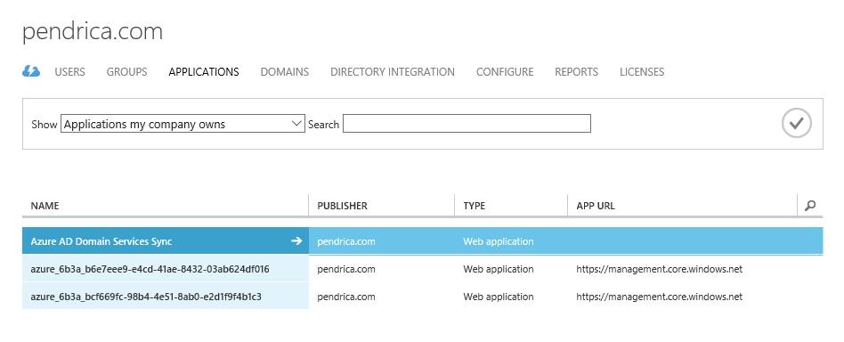
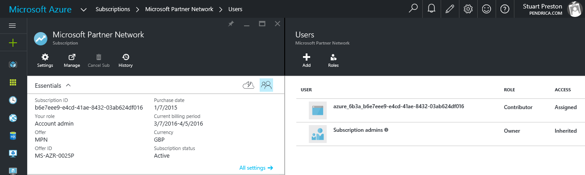

# azure-credentials

A tool to provide assistance for those struggling to create Applications, Service Principals and perform Role Assignments in Azure Resource Manager.
Generate your credentials file/helper for Chef, Puppet, Terraform and others!

## Background

Automated access to Azure Resource Manager usually requires PowerShell or the Azure-CLI and to follow the (many) manual steps in [create and authenticate a service principal](https://azure.microsoft.com/en-us/documentation/articles/resource-group-authenticate-service-principal/#authenticate-service-principal-with-password---azure-cli) to allow you to eventually retrieve 4 pieces of information:

1. **Subscription ID** 
2. **Client ID**
3. **Client Secret/Password**
4. **Tenant ID**

... you then use this information to configure your provisioning system. This tool (created in Ruby) requires only the credentials of the user with global administrator privilege and does the rest of the work for you, making it easier and quicker to get started with the various provisioning and testing toolsets out there.  

## Installation

The tool is distributed as a [Ruby Gem](https://rubygems.org/gems/azure-credentials).  To install it, run:

```gem install azure-credentials```

## Usage

```
Usage: azure-credentials (options)
    -l, --log_level LEVEL            Set the log level (debug, info, warn, error, fatal)
    -v, --verbose                    Display the credentials in STDOUT after creation? (warning: will contain secrets)
    -o, --output FILENAME            Enter the filename to save the credentials to
    -p, --password PASSWORD          Enter the password for the Azure AD user
    -r, --role ROLENAME              Enter the built-in Azure role to add the service principal to on your subscription (default: Contributor)
    -s, --subscription ID            Enter the Subscription ID to work against (default: process all subscriptions within the Azure tenant)
    -t, --type OUTPUTTYPE            Set the output type (default: chef)
    -u, --username USERNAME          Enter the username (must be an Azure AD user)
    -h, --help                       Show this message
```

## Default behaviour

By default (providing no options), the utility will prompt for your Azure AD username and password interactively, connect to Azure, retrieve details of all the subscriptions in your tenant, create an Application/Service Principal for each subscription then create you a credentials file with the relevant details that you can start to use with other tools immediately.

### Example output *(nb: ```chef exec``` typically is only required on Windows systems with ChefDK and no Ruby in their system path)*

```
PS C:\Users\StuartPreston\azure-credentials> chef exec azure-credentials
Enter your Azure AD username (user@domain.com): stuart@pendrica.com
Enter your password: 
INFO [2016-03-28 15:29:37] Authenticating to Azure Active Directory
INFO [2016-03-28 15:29:39] Retrieving tenant info
INFO [2016-03-28 15:29:40] Retrieving subscriptions info
INFO [2016-03-28 15:29:41] Creating application azure_6b3a_b6e7eee9-e4cd-41ae-8432-03ab624df016 in tenant 9c117323-1f20-444d-82a9-9ee430723ba3
INFO [2016-03-28 15:29:41] Creating service principal for application
INFO [2016-03-28 15:29:43] Waiting for service principal to be available in directory (retry 1)
INFO [2016-03-28 15:29:45] Attempting to assign service principal to role
INFO [2016-03-28 15:29:45] Waiting for service principal to be available in directory (retry 2)
INFO [2016-03-28 15:29:47] Attempting to assign service principal to role
INFO [2016-03-28 15:29:48] Waiting for service principal to be available in directory (retry 3)
INFO [2016-03-28 15:29:50] Attempting to assign service principal to role
INFO [2016-03-28 15:29:52] Assigned service principal to role Contributor in subscription b6e7eee9-e4cd-41ae-8432-03ab624df016
INFO [2016-03-28 15:29:52] Creating application azure_6b3a_bcf669fc-98b4-4e51-8ab0-e2d1f9f4b1c3 in tenant 9c117323-1f20-444d-82a9-9ee430723ba3
INFO [2016-03-28 15:29:53] Creating service principal for application
INFO [2016-03-28 15:29:54] Waiting for service principal to be available in directory (retry 1)
INFO [2016-03-28 15:29:56] Attempting to assign service principal to role
INFO [2016-03-28 15:29:56] Waiting for service principal to be available in directory (retry 2)
INFO [2016-03-28 15:29:58] Attempting to assign service principal to role
INFO [2016-03-28 15:29:58] Waiting for service principal to be available in directory (retry 3)
INFO [2016-03-28 15:30:00] Attempting to assign service principal to role
INFO [2016-03-28 15:30:04] Assigned service principal to role Contributor in subscription bcf669fc-98b4-4e51-8ab0-e2d1f9f4b1c3
INFO [2016-03-28 15:30:04] Creating credentials file at C:/Users/StuartPreston/azure-credentials/credentials
INFO [2016-03-28 15:30:04] Done!
```

You'll be able to see the output in the created credentials file (don't worry you can change the location using the -o switch)

```
PS C:\Users\StuartPreston\azure-credentials> cat ./credentials
[b6e7eee9-e4cd-41ae-8432-03ab624df016]
client_id = "5a8758f2-a2b2-4eab-8203-28c0840ccd7f"
client_secret = "ZSNdI5hQ9toavJNVgRjMjA=="
tenant_id = "9c117323-1f20-444d-82a9-9ee430723ba3"

[bcf669fc-98b4-4e51-8ab0-e2d1f9f4b1c3]
client_id = "2205cbcd-84dc-4b4a-9fcf-4a27d773a56d"
client_secret = "KboMQ86BvMGR6vO7_fUd1A=="
tenant_id = "9c117323-1f20-444d-82a9-9ee430723ba3"
```

(don't worry these accounts don't exist any more!)

If you look in the Azure Service Management portal and navigate to Active Directory > [directory name] > Applications (Show: Applications my company owns) you will see Applications created with the **azure_** prefix.  New identifiers are generated each time so there will be no overlap with existing accounts:



You will also see the role assignment when looking in the Azure Resource Manager portal > Subscriptions, selecting one and viewing the users:



## Some more advanced examples

### Chef quick config!

```azure-credentials -u username@domain.onmicrosoft.com -p "yourpassword" -o ~/.azure/credentials```

### Puppet-style output (note ```-v``` displays the file on screen after creation)

```azure-credentials -u username@domain.onmicrosoft.com -p "yourpassword" -o ./azure.conf -t puppet -v ```

```
PS C:\Users\StuartPreston\azure-credentials> chef exec azure-credentials -u stuart@pendrica.com -p "mypassword" -o ./azure.conf -t puppet -v
INFO [2016-03-28 16:01:58] Authenticating to Azure Active Directory
INFO [2016-03-28 16:02:00] Retrieving tenant info
INFO [2016-03-28 16:02:01] Retrieving subscriptions info
INFO [2016-03-28 16:02:01] Creating application azure_5291_b6e7eee9-e4cd-41ae-8432-03ab624df016 in tenant 9c117323-1f20-444d-82a9-9ee430723ba3
INFO [2016-03-28 16:02:02] Creating service principal for application
INFO [2016-03-28 16:02:03] Waiting for service principal to be available in directory (retry 1)
INFO [2016-03-28 16:02:05] Attempting to assign service principal to role
INFO [2016-03-28 16:02:05] Waiting for service principal to be available in directory (retry 2)
INFO [2016-03-28 16:02:07] Attempting to assign service principal to role
INFO [2016-03-28 16:02:08] Waiting for service principal to be available in directory (retry 3)
INFO [2016-03-28 16:02:10] Attempting to assign service principal to role
INFO [2016-03-28 16:02:10] Waiting for service principal to be available in directory (retry 4)
INFO [2016-03-28 16:02:12] Attempting to assign service principal to role
INFO [2016-03-28 16:02:16] Assigned service principal to role Contributor in subscription b6e7eee9-e4cd-41ae-8432-03ab624df016
INFO [2016-03-28 16:02:16] Creating application azure_5291_bcf669fc-98b4-4e51-8ab0-e2d1f9f4b1c3 in tenant 9c117323-1f20-444d-82a9-9ee430723ba3
INFO [2016-03-28 16:02:17] Creating service principal for application
INFO [2016-03-28 16:02:17] Waiting for service principal to be available in directory (retry 1)
INFO [2016-03-28 16:02:19] Attempting to assign service principal to role
INFO [2016-03-28 16:02:20] Waiting for service principal to be available in directory (retry 2)
INFO [2016-03-28 16:02:22] Attempting to assign service principal to role
INFO [2016-03-28 16:02:22] Waiting for service principal to be available in directory (retry 3)
INFO [2016-03-28 16:02:24] Attempting to assign service principal to role
INFO [2016-03-28 16:02:26] Assigned service principal to role Contributor in subscription bcf669fc-98b4-4e51-8ab0-e2d1f9f4b1c3
INFO [2016-03-28 16:02:26] Creating credentials file at C:/Users/StuartPreston/azure-credentials/azure.conf
azure: {
 subscription_id: "b6e7eee9-e4cd-41ae-8432-03ab624df016"
 tenant_id: '9c117323-1f20-444d-82a9-9ee430723ba3'
 client_id: '8dfab0fc-65c5-46d0-be1d-d5d301b3cbc9'
 client_secret: 'm_nh57rEZpGe5GFL8-Iceg=='
}

azure: {
 subscription_id: "bcf669fc-98b4-4e51-8ab0-e2d1f9f4b1c3"
 tenant_id: '9c117323-1f20-444d-82a9-9ee430723ba3'
 client_id: '951eab1c-7e77-4931-bb68-15ca2d05e69e'
 client_secret: 'vzl0haDXU51OukanIiRwJQ=='
}

INFO [2016-03-28 16:02:26] Done!
```

### Terraform-style output (note ```-v``` displays the file on screen after creation)

```azure-credentials -u username@domain.onmicrosoft.com -p "yourpassword" -o ./tf.creds -t terraform -v ```

```
PS C:\Users\StuartPreston\azure-credentials> chef exec azure-credentials -u stuart@pendrica.com -p "mypassword" -o ./tf.creds -t terraform -v
INFO [2016-03-28 16:04:32] Authenticating to Azure Active Directory
INFO [2016-03-28 16:04:34] Retrieving tenant info
INFO [2016-03-28 16:04:34] Retrieving subscriptions info
INFO [2016-03-28 16:04:34] Creating application azure_c346_b6e7eee9-e4cd-41ae-8432-03ab624df016 in tenant 9c117323-1f20-444d-82a9-9ee430723ba3
INFO [2016-03-28 16:04:35] Creating service principal for application
INFO [2016-03-28 16:04:36] Waiting for service principal to be available in directory (retry 1)
INFO [2016-03-28 16:04:38] Attempting to assign service principal to role
INFO [2016-03-28 16:04:42] Assigned service principal to role Contributor in subscription b6e7eee9-e4cd-41ae-8432-03ab624df016
INFO [2016-03-28 16:04:42] Creating application azure_c346_bcf669fc-98b4-4e51-8ab0-e2d1f9f4b1c3 in tenant 9c117323-1f20-444d-82a9-9ee430723ba3
INFO [2016-03-28 16:04:42] Creating service principal for application
INFO [2016-03-28 16:04:43] Waiting for service principal to be available in directory (retry 1)
INFO [2016-03-28 16:04:45] Attempting to assign service principal to role
INFO [2016-03-28 16:04:45] Waiting for service principal to be available in directory (retry 2)
INFO [2016-03-28 16:04:47] Attempting to assign service principal to role
INFO [2016-03-28 16:04:52] Assigned service principal to role Contributor in subscription bcf669fc-98b4-4e51-8ab0-e2d1f9f4b1c3
INFO [2016-03-28 16:04:52] Creating credentials file at C:/Users/StuartPreston/azure-credentials/tf.creds
provider "azurerm" {
  subscription_id = "b6e7eee9-e4cd-41ae-8432-03ab624df016"
  client_id       = "8a5b76c7-721f-4710-b491-8d657c9a7497"
  client_secret   = "rGRLfflNSFo7O4t2vBU7pg=="
  tenant_id       = "9c117323-1f20-444d-82a9-9ee430723ba3"
}

provider "azurerm" {
  subscription_id = "bcf669fc-98b4-4e51-8ab0-e2d1f9f4b1c3"
  client_id       = "0af58eee-25ce-467a-8e7c-05a35783385f"
  client_secret   = "UvB-HJPoiOpujufeJjp5Ag=="
  tenant_id       = "9c117323-1f20-444d-82a9-9ee430723ba3"
}

INFO [2016-03-28 16:04:52] Done!
```

## Not supported

1. Currently this tool does not support certificate-based authentication. 
2. This tool will not work if MFA (multi-factor authentication) is set to **required** for administration of the Azure Active Directory domain.

## Contributing

I'm sure many improvements can be made to this tool! Contributions to the project are welcome via submitting Pull Requests.

1. Fork it ( https://github.com/pendrica/azure-credentials/fork )
2. Create your feature branch (`git checkout -b my-new-feature`)
3. Commit your changes (`git commit -am 'Add some feature'`)
4. Push to the branch (`git push origin my-new-feature`)
5. Create a new Pull Request
